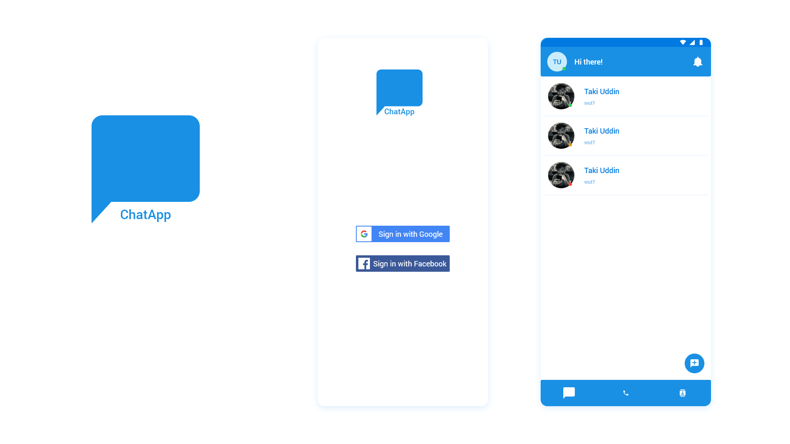

<h1> ChatApp</h1>

## Description

A Flutter Chat Application, using Firebase for Google Sign In/Sign Up, exchange texts, emojis, and images. Integrated Agora Sdk for communicating over video calls. A little tweaking to communicate over voice calls only.

## Get Started

*   Clone this repo
*   Run `flutter packages get`
*   Run `flutter run` (remember to open simulator or connect physical device, iOS auto run additional command `pod install`)

## Setup

Connect the app to your Firebase Project from your [Firebase Console](http://console.firebase.google.com) and add the `google-services.json` in the `/android/app` directory.

Inside `/lib` directory make a new directory `/configs`, where you'll need to make two new files `agora_configs.dart` and `firebase_configs.dart`.

Inside `agora_configs.dart` add:

  `const APP_ID = '<YOUR_AGORA_SDK_TOKEN>';` from your [Agora.io](https://console.agora.io).

Inside `firebase_configs.dart` add: 
  
  `const SERVER_KEY = '<YOUR_FIREBASE_SERVER_KEY>';` from your [Firebase Console](http://console.firebase.google.com).

## ChatApp UI

## TODO

*   Integrate Facebook Sign in and Sign up.
*   Enable Group Chats.
*   Enable Group Calls.

## For Beginners

A few resources to get you started if this is your first Flutter project:

*   [Lab: Write your first Flutter app](https://flutter.dev/docs/get-started/codelab)
*   [Cookbook: Useful Flutter samples](https://flutter.dev/docs/cookbook)

For help getting started with Flutter, view our
[online documentation](https://flutter.dev/docs), which offers tutorials,
samples, guidance on mobile development, and a full API reference.

## LICENSE

MIT License

Copyright (c) 2020 Taki Uddin

Permission is hereby granted, free of charge, to any person obtaining a copy
of this software and associated documentation files (the "Software"), to deal
in the Software without restriction, including without limitation the rights
to use, copy, modify, merge, publish, distribute, sublicense, and/or sell
copies of the Software, and to permit persons to whom the Software is
furnished to do so, subject to the following conditions:

The above copyright notice and this permission notice shall be included in all
copies or substantial portions of the Software.

THE SOFTWARE IS PROVIDED "AS IS", WITHOUT WARRANTY OF ANY KIND, EXPRESS OR
IMPLIED, INCLUDING BUT NOT LIMITED TO THE WARRANTIES OF MERCHANTABILITY,
FITNESS FOR A PARTICULAR PURPOSE AND NONINFRINGEMENT. IN NO EVENT SHALL THE
AUTHORS OR COPYRIGHT HOLDERS BE LIABLE FOR ANY CLAIM, DAMAGES OR OTHER
LIABILITY, WHETHER IN AN ACTION OF CONTRACT, TORT OR OTHERWISE, ARISING FROM,
OUT OF OR IN CONNECTION WITH THE SOFTWARE OR THE USE OR OTHER DEALINGS IN THE
SOFTWARE.

